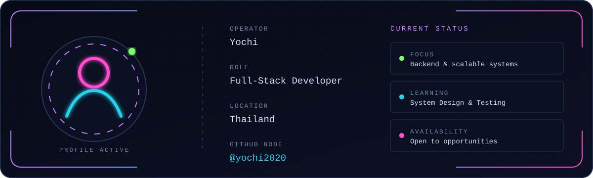
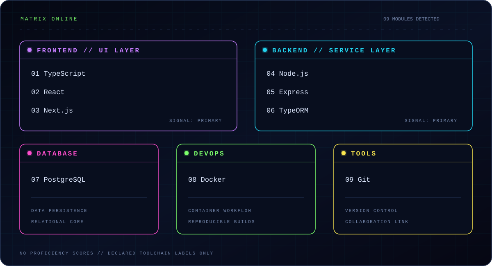

<!-- GitHub Profile README for yochi2020 — public profile data only. -->

<div align="center">
  
</div>

<div align="center">
  <a href="#system_profile">Profile</a>&nbsp;&nbsp;•&nbsp;&nbsp;
  <a href="#technology_matrix">Stack</a>&nbsp;&nbsp;•&nbsp;&nbsp;
  <a href="#selected_builds">Projects</a>&nbsp;&nbsp;•&nbsp;&nbsp;
  <a href="#github_telemetry">Telemetry</a>&nbsp;&nbsp;•&nbsp;&nbsp;
  <a href="#open_channel">Contact</a>
</div>

<br />

## `SYSTEM_PROFILE`

<div align="center">
  
</div>

I’m **Yochi**, a **Full-Stack Developer** building dependable web products from accessible interfaces to maintainable APIs and data layers. I care about clear architecture, practical security, and shipping software that remains understandable after the first release.

```text
operator   : Yochi
role       : Full-Stack Developer
location   : Thailand
focus      : Backend development & scalable systems
learning   : System Design & Testing
status     : Open to Full-Stack opportunities
```

> [!NOTE]
> Currently learning Advanced TypeScript, Clean Architecture, System Design, CI/CD, Docker, Testing, and Performance Optimization.

## `TECHNOLOGY_MATRIX`

<div align="center">
  
</div>

<table>
  <tr>
    <td width="24%"><strong>◈ Frontend</strong></td>
    <td>JavaScript · TypeScript · React · Next.js · HTML · CSS · Tailwind CSS · Bootstrap</td>
  </tr>
  <tr>
    <td><strong>◆ Backend</strong></td>
    <td>Node.js · Express · TypeORM · Mongoose</td>
  </tr>
  <tr>
    <td><strong>⬡ Database</strong></td>
    <td>PostgreSQL · MongoDB</td>
  </tr>
  <tr>
    <td><strong>▣ DevOps</strong></td>
    <td>Docker · Docker Compose</td>
  </tr>
  <tr>
    <td><strong>⌁ Tools</strong></td>
    <td>Git · GitHub · VS Code · Postman · MongoDB Compass · pgAdmin</td>
  </tr>
</table>

<details>
  <summary><strong>Skill signal legend</strong></summary>
  <br />
  The visual cards identify technologies in the current toolchain; they do not claim a fabricated proficiency score, certification, or number of years.
</details>

## `SELECTED_BUILDS`

<table>
  <tr>
    <td width="100%" valign="top">
      <h3>01 // Review Full-Stack</h3>
      <p>A full-stack review project built around TypeScript, React, Node.js, and TypeORM.</p>
      <p><code>TypeScript · React · Node.js · TypeORM</code></p>
      <a href="https://github.com/yochi2020/Review-fullstack-Node-TypeOrm-React-Typescript">Explore repository →</a>
    </td>
  </tr>
  <tr>
    <td width="100%" valign="top">
      <h3>02 // Backend Project Structure</h3>
      <p>A backend project structure using Node.js and Sequelize configuration.</p>
      <p><code>JavaScript · Node.js · Sequelize</code></p>
      <a href="https://github.com/yochi2020/project">Explore repository →</a>
    </td>
  </tr>
  <tr>
    <td width="100%" valign="top">
      <h3>03 // Node + TypeScript Structure</h3>
      <p>A reusable Node.js and TypeScript project structure with an ESLint-focused development setup.</p>
      <p><code>TypeScript · Node.js · ESLint</code></p>
      <a href="https://github.com/yochi2020/structure-node-typescript">Explore repository →</a>
    </td>
  </tr>
  <tr>
    <td width="100%" valign="top">
      <h3>04 // React + TypeScript Structure</h3>
      <p>A project structure for organizing React applications with TypeScript.</p>
      <p><code>React · TypeScript</code></p>
      <a href="https://github.com/yochi2020/structure-react-typescript">Explore repository →</a>
    </td>
  </tr>
</table>

## `GITHUB_TELEMETRY`

<!--
  These cards load read-only public GitHub data from third-party renderers.
  If a renderer is temporarily unavailable, the rest of this README still works
  and the native GitHub activity link below remains available.
-->

<div align="center">
  <a href="https://github.com/yochi2020">
    
  </a>
  <a href="https://github.com/yochi2020?tab=repositories">
    
  </a>
</div>

### `// CONTRIBUTION_ACTIVITY`

<div align="center">
  <a href="https://github.com/yochi2020">
    
  </a>
</div>

<p align="center">
  External card offline?
  <a href="https://github.com/yochi2020">Open the native GitHub contribution overview →</a>
</p>

## `OPEN_CHANNEL`

<div align="center">
  <a href="https://www.instagram.com/yochi.suzuki">
    
  </a>
  <a href="https://github.com/yochi2020">
    
  </a>
  <a href="https://github.com/yochi2020?tab=repositories">
    
  </a>
</div>

<br />

<div align="center">
  
</div>

<p align="center">
  <sub>Designed for GitHub • no client-side JavaScript • public data only</sub>
</p>
